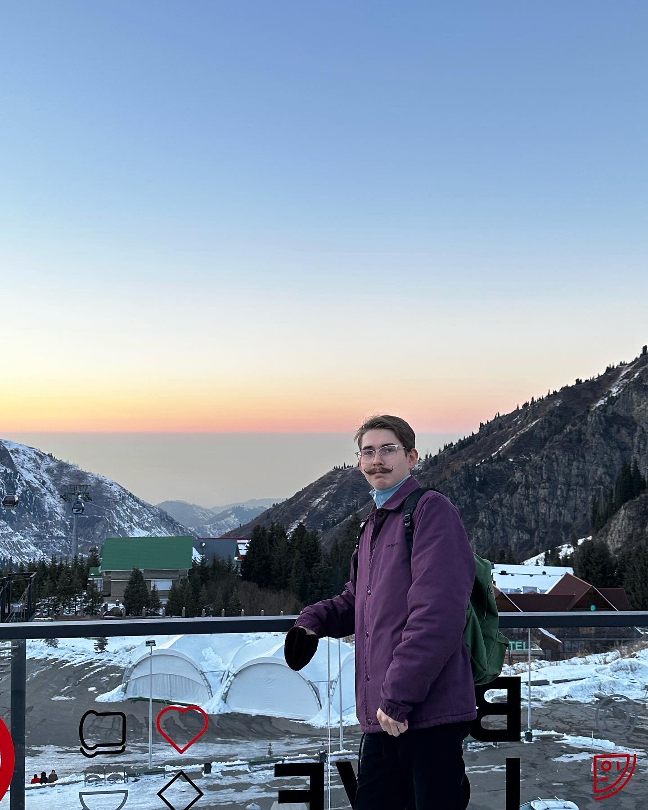

# Обо мне

Меня зовут Зайнуллин Нияз, мне 22 года. Через 7 дней исполнится 23. Живу в Казани. Я уже пол года работаю оператором производственной линии на заводе. Моя линия изготавливает крышки и основания для упаковок кетчупа, майонеза и тому подобных продуктов. В свободное время я люблю гулять с друзьми, смотреть фильмы. Немного увлекаюсь изучением экономики, политологии и истории. Еще принято писать про хобби, но хобби у меня нет, ну разве что есть бургеры в разных заведениях и составлять топы. 

Кроме нетологии я, учусь в аграрном университете на бухгалтера. Не то чтобы мне это прям нравится, но иногда забавно писать контрольную на тему, как правильно сажать картошу или высчитывать, где какую свеклу сажать и чем удобрять.

А это я, усатый)))
